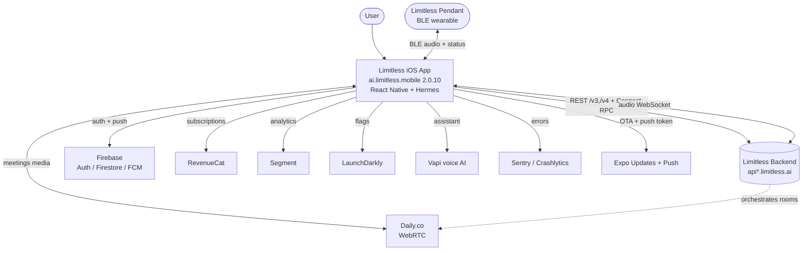
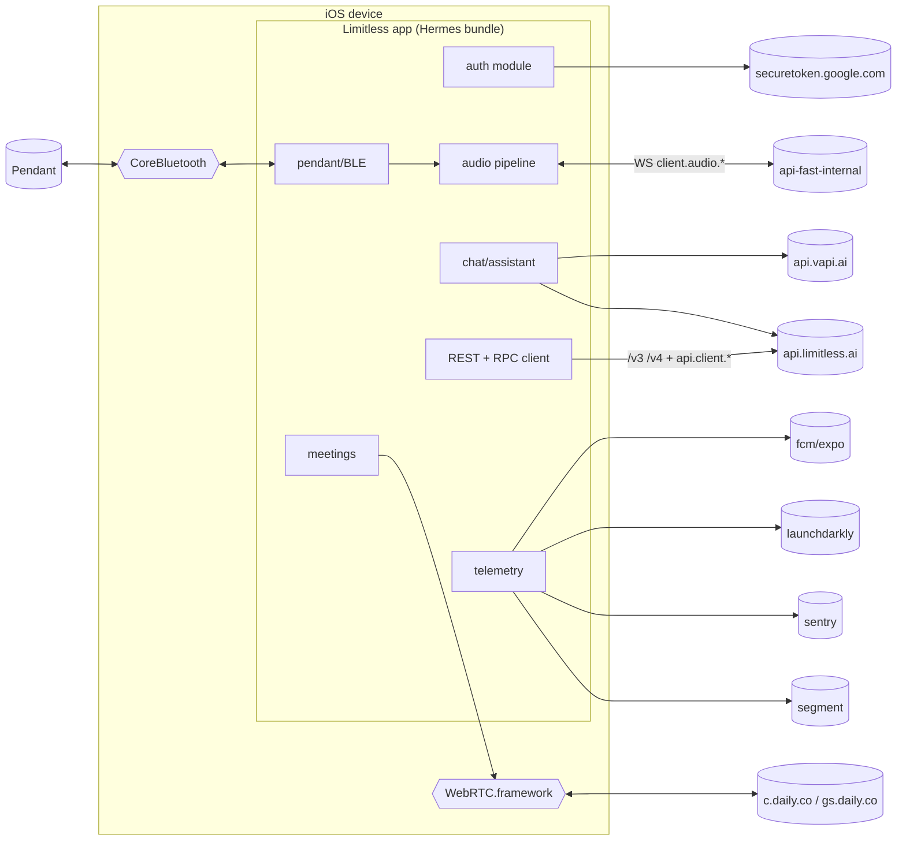
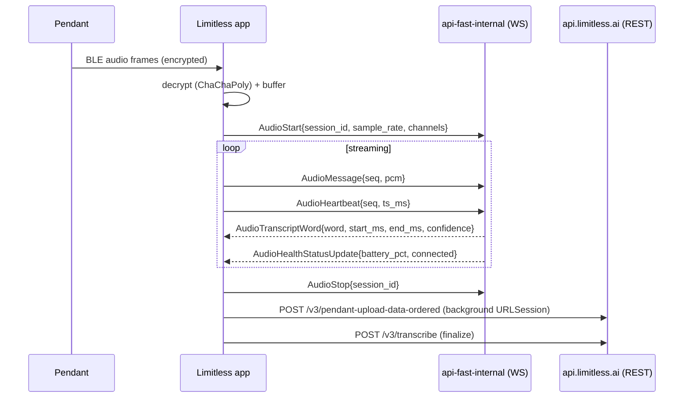

# Limitless — Architecture & Code Analysis

> **Analysis Date:** 2026-06-24
> **Subject:** `ai.limitless.mobile` 2.0.10 (build 223)
> **Method:** Reversa SDD — 🟢 confirmed · 🟡 inferred · 🔴 gap
> **Evidence base:** `limitless/analysis/_shared/INTEL.md`

C4-style architecture view of the Limitless Pendant app's communications, plus the module-level
code-analysis surface map.

---

## Table of Contents

1. [C4 L1 — System Context](#1-c4-l1--system-context)
2. [C4 L2 — Container / Channel View](#2-c4-l2--container--channel-view)
3. [Integration Matrix](#3-integration-matrix)
4. [Module Surface Map](#4-module-surface-map)
5. [Audio Capture → Transcript Sequence](#5-audio-capture--transcript-sequence)
6. [Environments](#6-environments)
7. [Gaps Requiring Dynamic Validation](#7-gaps-requiring-dynamic-validation)

---

## 1. C4 L1 — System Context

---

## 2. C4 L2 — Container / Channel View

---

## 3. Integration Matrix

| Channel | Tech | First/Third-party | Auth | Data |
|---------|------|-------------------|------|------|
| Core API | REST + Connect-RPC/protobuf | First | Firebase Bearer | account, lifelog, meetings, chat |
| Audio | WebSocket (protobuf) | First | Bearer/session | PCM frames, transcripts, health |
| Meetings | WebRTC | Daily.co | meeting token | media, live notes |
| Pendant | BLE GATT | First (HW) | signed manifest + encryption | audio, device status |
| Identity | Firebase Auth + Google/Apple | Third | OAuth/email-link | tokens |
| Push | FCM + Expo | Third | device token | notifications |
| Billing | RevenueCat | Third | app user id | entitlements |
| Analytics/Flags/Errors | Segment / LaunchDarkly / Sentry | Third | write keys | events |

---

## 4. Module Surface Map

🟢 **Architecture:** React Native + Expo app. UI/business logic compiled to **Hermes bytecode**
(`main.jsbundle`). The native arm64 Mach-O host is a thin RN runtime + Expo modules; it is
FairPlay-encrypted (App Store DRM), so native logic is opaque — but the comms logic lives in the
(unencrypted) Hermes bundle and native frameworks.

🟢 **Communication modules identified:**

| Module | Responsibility | Transport | Evidence |
|--------|----------------|-----------|----------|
| `auth` | Sign-in, token lifecycle | Firebase Auth + Connect-RPC | `SignInRequest`, `securetoken.google.com`, URL scheme `com.googleusercontent.apps.*` |
| `account` | Account create/status/metadata | Connect-RPC + REST `/v3/account/*` | `AccountCreateRequest`, `AccountStatusResponse`, `/v3/account/delete-user` |
| `pendant` | BLE device link, provisioning, audio upload | BLE + REST `/v3/pendant/*` | `bluetooth-central`, `sendRealTimeAudioDataToPendantDevice`, `/v3/pendant/provisionPendant` |
| `audio` | Real-time capture → transcript pipeline | WebSocket `client.audio.*` | `AudioStart/Stop/Heartbeat`, `WebsocketResponseType`, `/v3/transcribe` |
| `meetings` | Meeting capture, summary, live notes | REST `/v3/meetings/*` + Daily WebRTC | `client.meeting.LiveNotes`, `c.daily.co`, `/v3/meetings/summary` |
| `chat` | AI chat / assistant | REST `/v4/chat`, `/v2/assistant` | `/v4/chat`, `/v4/chat/warm-cache`, `api.vapi.ai` |
| `search` | Lifelog search | REST `/v3/search` | `/v3/search`, `LifelogEntry` |
| `contacts` | Directory / contacts / tasks | REST `/auth/*` | `/auth/contacts`, `/auth/directory`, `/auth/tasks` |
| `billing` | Subscriptions / paywall | RevenueCat SDK | `api.revenuecat.com`, `PurchasesHybridCommon.bundle` |
| `telemetry` | Analytics, crash, flags, push | Segment / Sentry / LaunchDarkly / FCM / Crashlytics | host table |

**External integrations** (🟢 confirmed from host + bundle signatures): Daily.co (WebRTC) · Firebase
(Auth/Firestore/FCM/Crashlytics) · Expo (Updates + Push) · Segment · RevenueCat · LaunchDarkly · Vapi
(voice AI) · Sentry · Twilio (phone import) · Google Sign-In · Apple Sign-In.

---

## 5. Audio Capture → Transcript Sequence

---

## 6. Environments

🟢 Production / Staging / Dev, each with `api`, `api-internal`, `api-fast-internal`, `app` hosts.
GCP logging projects: `limitless-413516` (prod), `limitless-staging-413617`, `limitless-dev-426019`.
🟡 `tail7edd25.ts.net` ATS exception ⇒ a **Tailscale** path used for internal/dev access.

---

## 7. Gaps Requiring Dynamic Validation

🔴 **LACUNA** — needs instrumented runtime / MITM proxy:

- Exact request/response JSON shapes per REST route (only path + verb inference are static).
- Whether the audio pipeline runs over raw WebSocket vs Connect-RPC streaming vs gRPC-web.
- BLE GATT service/characteristic UUIDs (native CoreBluetooth code is FairPlay-encrypted).
- Field-level protobuf schemas (message names confirmed; tag numbers/types not recoverable statically).

---

## Support

- Overview: [LIMITLESS_COMMS_ANALYSIS.md](./LIMITLESS_COMMS_ANALYSIS.md)
- API contract: [LIMITLESS_API_SPECIFICATION.md](./LIMITLESS_API_SPECIFICATION.md)
- Native capability evidence: [LIMITLESS_NATIVE_ANALYSIS.md](./LIMITLESS_NATIVE_ANALYSIS.md)
