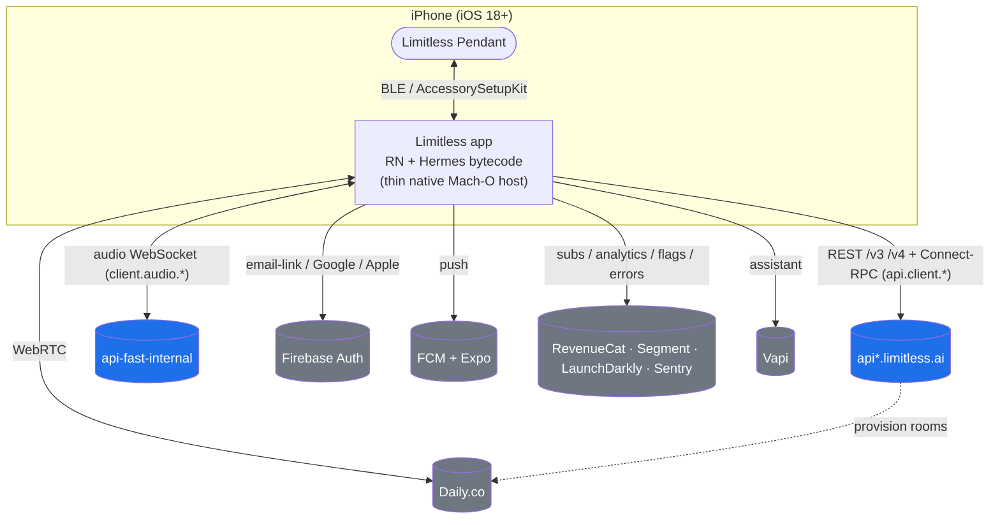

# Limitless Pendant — Communications Reverse-Engineering

> **Analysis Date:** 2026-06-24
> **Subject:** `ai.limitless.mobile` 2.0.10 (build 223) — Limitless Pendant iOS app
> **Source analysis:** `limitless/analysis/` (ghidra · reversa · sdkgenny tracks)

Independent reconstruction, from **static analysis** of a public App Store binary, of the Limitless
Pendant app's **communication API** — recovered and documented with diagrams. Captured here for the
ZEKE team as a reference for wearable/pendant comms patterns.

> ⚠️ **Scope & ethics.** Interoperability/research only. Not official; no DRM was circumvented — the
> FairPlay-encrypted region was **not** decrypted. Analysis used unencrypted Hermes bytecode, native
> symbols, Mach-O load commands, and bundle resources only.

---

## Table of Contents

1. [Document Set](#1-document-set)
2. [Target Profile](#2-target-profile)
3. [System Overview](#3-system-overview)
4. [Headline Findings](#4-headline-findings)
5. [The Three Analysis Tracks](#5-the-three-analysis-tracks)
6. [Confidence Model](#6-confidence-model)
7. [Reproduce](#7-reproduce)

---

## 1. Document Set

This analysis is split across companion documents, each covering one facet of the comms surface:

| Document | Covers |
|----------|--------|
| **LIMITLESS_COMMS_ANALYSIS.md** (this file) | Overview, target profile, system map, findings |
| [LIMITLESS_API_SPECIFICATION.md](./LIMITLESS_API_SPECIFICATION.md) | Transports, REST/RPC/WebSocket contract, auth, security |
| [LIMITLESS_ARCHITECTURE.md](./LIMITLESS_ARCHITECTURE.md) | C4 views, module map, integration matrix, key flows |
| [LIMITLESS_NATIVE_ANALYSIS.md](./LIMITLESS_NATIVE_ANALYSIS.md) | Ghidra native Mach-O capability map + symbol findings |
| [LIMITLESS_SDK.md](./LIMITLESS_SDK.md) | Typed C++ SDK reconstruction of the comms surface |

---

## 2. Target Profile

| Fact | Value |
|------|-------|
| Bundle ID | `ai.limitless.mobile` |
| Version | 2.0.10 (build 223) |
| Min iOS | 18.0 |
| Stack | React Native + Expo, **Hermes bytecode v96** (`main.jsbundle`, 13.5 MB) over a native arm64 Mach-O host |
| Native binary | FairPlay-encrypted (`SC_Info/*.sinf`, `cryptid=1`) — `__TEXT` opaque; symbols/strings/load-cmds recoverable |
| Frameworks | `hermes`, `WebRTC`, `ReactNativeDailyJSScreenShareExtension` |
| OTA updates | Expo Updates → `https://u.expo.dev/e6c4c5ef-39ee-4e71-9de9-519a3b1be203` (CheckOnLaunch=ALWAYS) |
| Firebase project | `limitless-413516` (bucket `limitless-413516.appspot.com`, FCM sender `776391384704`) |
| GCP logging | `limitless-413516` (prod), `limitless-staging-413617`, `limitless-dev-426019` |

**URL schemes & background modes (Info.plist):**

- URL schemes: `ai.limitless.mobile`, `exp+limitless`, Google OAuth reverse-client `com.googleusercontent.apps.776391384704-…`
- `UIBackgroundModes`: **`bluetooth-central`** (Pendant), **`voip`**, `remote-notification`, `fetch`, `processing`
- ATS: `NSAllowsArbitraryLoads=false`; single exception domain `tail7edd25.ts.net` (a **Tailscale** tailnet — internal/dev access, TLS1.0 + insecure HTTP allowed)

---

## 3. System Overview



---

## 4. Headline Findings

1. **Hybrid transport stack:** REST (`/v3`, `/v4`) **and** Connect-RPC/protobuf over the same
   `api.limitless.ai`, **plus** a protobuf-over-WebSocket audio pipeline on a dedicated
   `api-fast-internal` host, **plus** Daily.co WebRTC for meetings, **plus** a BLE Pendant channel.
2. **Pendant security:** provisioning is admin-gated; audio is encrypted (CryptoKit ChaChaPoly +
   `/v3/pendant/audio-encryption` + Curve25519-signed manifests); pairing uses iOS 18 AccessorySetupKit.
3. **Three environments** (prod/staging/dev) with internal + fast-internal API tiers; a Tailscale
   ATS exception (`tail7edd25.ts.net`) hints at internal access paths.
4. **Identity:** Firebase ID-token bearer auth (email-link / Google / Apple); DeviceCheck attestation.

---

## 5. The Three Analysis Tracks

| Track | Tool | Question it answers | Primary outputs |
|-------|------|---------------------|-----------------|
| **ghidra** | Ghidra 12.1.2 headless | *What native OS capabilities is the app wired to?* | Native capability map, symbol findings → [LIMITLESS_NATIVE_ANALYSIS.md](./LIMITLESS_NATIVE_ANALYSIS.md) |
| **reversa** | Reversa SDD method | *What is the communication contract & architecture?* | API spec + C4 architecture → [LIMITLESS_API_SPECIFICATION.md](./LIMITLESS_API_SPECIFICATION.md), [LIMITLESS_ARCHITECTURE.md](./LIMITLESS_ARCHITECTURE.md) |
| **sdkgenny** | sdkgenny (C++) | *Can the contract be expressed as a typed, consistent SDK?* | 34-header typed SDK → [LIMITLESS_SDK.md](./LIMITLESS_SDK.md) |

The three are complementary: **Ghidra** establishes that this is a thin native host running Hermes
bytecode (so the contract lives in JS) and maps the native capability surround; **Reversa** turns the
mined contract into human/machine specs; **sdkgenny** compiles it into a type-checked SDK.

---

## 6. Confidence Model

Findings are tagged throughout:

- 🟢 **confirmed** — extracted directly from binary/bundle evidence
- 🟡 **inferred** — pattern-based, consistent with evidence but not directly proven
- 🔴 **gap** — requires dynamic analysis (instrumented runtime / MITM proxy)

The biggest 🔴 gaps — field-level protobuf schemas, REST body shapes, and BLE GATT UUIDs — live in
encrypted native code or are simply not statically recoverable from Hermes bytecode, and are out of
scope for this static pass.

---

## 7. Reproduce

Toolchain on PATH (Unraid devtools box):

```bash
export PATH=/mnt/nvme/devtools/env/bin:$PATH            # strings / g++ / cmake
export JAVA_HOME=/mnt/nvme/devtools/env/lib/jvm         # Ghidra headless JRE
```

See each companion document's reproduce section for track-specific commands. The raw evidence base
(string/host/route lists, `INTEL.md`) lives under `limitless/analysis/_shared/`.

---

## Support

- Source analysis tree: `limitless/analysis/` (README + `_shared/INTEL.md`)
- Companion docs: see [Document Set](#1-document-set)
- Diagrams render natively in VS Code → Markdown Preview Enhanced, GitHub, and mermaid.live
